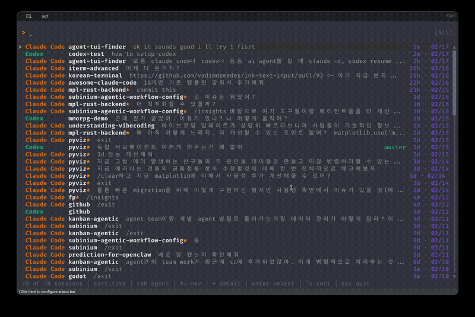

# agf
[](https://github.com/subinium/agf/actions)
[](https://github.com/subinium/agf/releases)
[](LICENSE)

> A fast TUI to find, resume, and manage your AI coding agent sessions.
> Supports **Claude Code**, **Codex**, **OpenCode**, **pi**, **Kiro**, and **Cursor CLI** — all in one place.



## Quick Start

```bash
brew install subinium/tap/agf
agf setup
```

Restart your shell. Then just type `agf`.

### Quick Resume (no TUI)

```bash
agf resume project-name   # fuzzy-matches and resumes the best match directly
```

## Why agf?

If you use AI coding agents, you've probably done this:

1. Forget which project you were working on
2. `cd` into the wrong directory
3. Try to remember the session ID
4. Give up and start a new session

`agf` fixes that. It scans all your agent sessions, shows them in a searchable list, and lets you resume with one keystroke.

## Features

- **Unified view** — Claude Code, Codex, OpenCode, pi, Kiro, and Cursor CLI sessions in one list
- **Fuzzy search** — find any session by project name or summary
- **One-key resume** — select a session and hit Enter
- **Agent filter** — Tab to cycle through agents
- **Smart cd** — jump to any project directory
- **Bulk delete** — `Ctrl+D` to multi-select and batch-delete sessions
- **New session** — launch a new agent session with optional permission mode
- **Quick resume** — `agf resume <query>` to skip the TUI and resume directly
- **Auto-detection** — only shows agents installed on your system

## Keybindings

### Browse

| Key | Action |
|:---|:---|
| Type anything | Fuzzy search |
| `↑` `↓` | Navigate |
| `Shift+↑` `Shift+↓` | Cycle session summary |
| `Enter` | Open action menu |
| `→` | Preview session details |
| `Tab` / `Shift+Tab` | Cycle agent filter |
| `Ctrl+S` | Cycle sort (time / name / agent) |
| `Ctrl+D` | Enter bulk delete mode |
| `Esc` | Quit |

### Bulk Delete (`Ctrl+D`)

| Key | Action |
|:---|:---|
| `Space` | Toggle selection + move down |
| `↑` `↓` | Navigate |
| `Enter` | Confirm deletion (when items selected) |
| `Esc` | Cancel and return to browse |

### New Session (Agent Select)

| Key | Action |
|:---|:---|
| `1`-`9` | Quick select agent |
| `Tab` | Open permission/approval mode picker |
| `Enter` | Launch with default mode |
| `Esc` | Back |

## Config

Optional. Create `~/.config/agf/config.toml`:

```toml
sort_by = "time"            # "time" | "name" | "agent"
max_sessions = 200
search_scope = "name_path"  # "name_path" (default) | "all" (include summaries)
summary_search_count = 5    # number of summaries included when search_scope = "all"
```

You can also edit `search_scope` and `summary_search_count` interactively by pressing `?` in the TUI.

## Supported Agents

| Agent | Resume Command | Data Source |
|:---|:---|:---|
| [Claude Code](https://github.com/anthropics/claude-code) | `claude --resume <id>` | `~/.claude/history.jsonl` |
| [Codex](https://github.com/openai/codex) | `codex resume <id>` | `~/.codex/sessions/**/*.jsonl` |
| [OpenCode](https://github.com/opencode-ai/opencode) | `opencode -s <id>` | `~/.local/share/opencode/opencode.db` |
| [pi](https://github.com/badlogic/pi-mono) | `pi --resume` | `~/.pi/agent/sessions/<cwd>/*.jsonl` |
| [Kiro](https://kiro.dev) | `kiro-cli chat --resume` | `~/Library/Application Support/kiro-cli/data.sqlite3` |
| [Cursor CLI](https://docs.cursor.com/agent) | `cursor-agent --resume <id>` | `~/.cursor/projects/*/agent-transcripts/*.txt` |

### Session Storage Paths

| Agent | Format | Default Path |
|:---|:---|:---|
| Claude Code | JSONL | `~/.claude/history.jsonl` |
| Codex | JSONL | `~/.codex/sessions/YYYY/MM/DD/rollout-*.jsonl` |
| OpenCode | SQLite | `~/.local/share/opencode/opencode.db` |
| pi | JSONL | `~/.pi/agent/sessions/--<encoded-cwd>--/<ts>_<id>.jsonl` |
| Kiro | SQLite | macOS: `~/Library/Application Support/kiro-cli/data.sqlite3`<br>Linux: `~/.local/share/kiro-cli/data.sqlite3` |
| Cursor CLI | SQLite + TXT | `~/.cursor/chats/*/<id>/store.db`<br>`~/.cursor/projects/*/agent-transcripts/<id>.txt` |

## Install (other methods)

<details>
<summary>From source</summary>

```bash
git clone https://github.com/subinium/agf.git
cd agf
cargo install --path .
agf setup
```

</details>

## Requirements

- macOS or Linux
- One or more of: `claude`, `codex`, `opencode`, `pi`, `kiro-cli`, `cursor-agent`

## Contributing

Issues and PRs are welcome.

### Contributors

[](https://github.com/subinium/agf/graphs/contributors)

## License

[MIT](LICENSE)

---

### Agent Support Roadmap

**Gemini CLI** and **Amp** are not yet supported. Both tools store session data without a direct mapping between session files and project directories (Gemini uses SHA-256 hashed directory names; Amp stores sessions on a remote server), making it difficult to reliably resolve project paths from session metadata. We are monitoring upstream changes and will add support when feasible.
