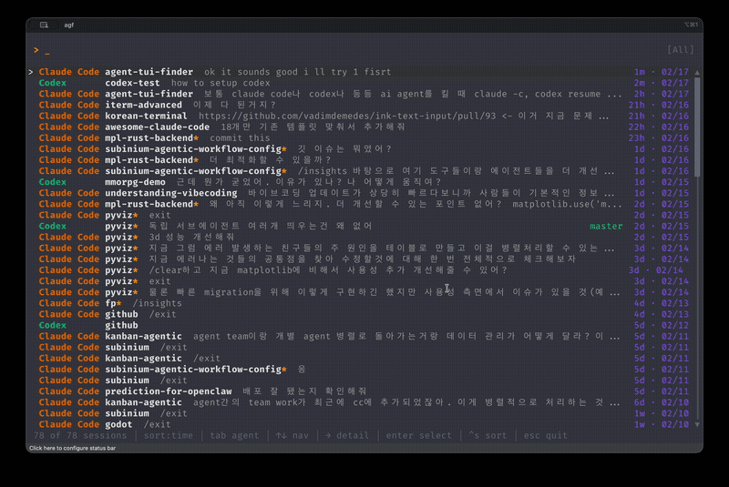

# agf

[](https://github.com/subinium/agf/actions)
[](https://github.com/subinium/agf/releases)
[](https://crates.io/crates/agf)
[](LICENSE)

> Find the AI coding session you meant to resume.

`agf` is a local-first fuzzy finder for AI coding-agent sessions.
Search the sessions your terminal agents already keep locally, then resume the right one in a keystroke.



## Install

```bash
cargo install agf --locked
agf
```

Building with Cargo requires Rust **1.88 or newer** and a C compiler for bundled
SQLite. `--locked` uses the dependency versions tested with the release.
Cargo's `Adding ... (available: ...)` lines are version-selection information,
not build failures; a newer dependency may require an API or Rust-version change.

Prebuilt binaries for macOS, Linux, and Windows need no Rust toolchain and are
available on the [Releases page](https://github.com/subinium/agf/releases).
On macOS or Linux, Homebrew is another option:

```bash
brew install subinium/tap/agf
```

For parent-shell directory changes, run `agf setup`, then restart your shell or
follow its reload instruction. This optional step edits your shell profile; the
TUI, JSON commands and MCP server also work without it.

### Upgrade

Run `cargo install agf --locked` again, or `brew upgrade subinium/tap/agf` for a
Homebrew installation. Check `agf --version` afterwards. If it still reports an
older version, use `type -a agf` (PowerShell: `Get-Command agf -All`) to find a
shell wrapper or an earlier Cargo/Homebrew executable on PATH.

### Quick Resume (no TUI)

```bash
agf resume project-name   # fuzzy-matches and resumes the best match directly
```

### Scripts and agent tools

```bash
agf search parser --agent codex --limit 10
agf show SESSION_ID --agent codex --include-summaries
agf resume-plan SESSION_ID --agent codex
agf capabilities
agf mcp --agent codex --project /absolute/project/path
```

The first four commands return versioned JSON. They do not launch agents or
modify their stores; `resume-plan` returns literal arguments, working directory
and scoped storage environment for review. The stdio MCP server uses the same
read-only API. See [agent integration](docs/AGENT_INTEGRATION.md) for schemas,
limits, client configuration and the portable [AGF skill](skills/agf/SKILL.md).

## Why agf?

AI coding agents are great at keeping context — until you lose the terminal.

You switch projects, close a tab, forget the session ID, or resume the wrong agent.
Then you either dig through history files or start over.

`agf` gives you one searchable list of local agent sessions and resumes the right one.

## Supported agents

`agf` reads the session files each agent already stores locally. No account, no cloud sync, no extra agent process.

| Agent | Resume command | Local session source |
|:---|:---|:---|
| [Claude Code](https://github.com/anthropics/claude-code) | `claude --resume <id>` | `~/.claude/history.jsonl` + `~/.claude/projects/` |
| [Codex](https://github.com/openai/codex) | `codex resume <id>` | `~/.codex/sessions/**/*.jsonl` |
| [Grok Build](https://github.com/xai-org/grok-build) | `grok --resume <id>` | `$GROK_HOME/sessions/` or `~/.grok/sessions/` |
| [Kimi Code](https://github.com/MoonshotAI/kimi-code) | `kimi --session <id>` | `$KIMI_CODE_HOME/sessions/` or `~/.kimi-code/sessions/` |
| [Qwen Code](https://github.com/QwenLM/qwen-code) | `qwen --resume <id>` | `$QWEN_RUNTIME_DIR/projects/` or `~/.qwen/projects/` |
| [Prime Agent](https://github.com/PrimeIntellect-ai/prime-agent) | `prime-agent --resume <id>` | `~/.prime/agent/sessions/<id>.jsonl` |
| [Gemini CLI](https://github.com/google-gemini/gemini-cli) | `gemini --resume <id>` | `~/.gemini/tmp/<project>/chats/session-*.json` or `.jsonl` |
| [Antigravity CLI](https://antigravity.google/docs/cli/conversations/) | `agy --conversation <id>` | `~/.gemini/antigravity-cli/conversation_summaries.db` + `brain/<id>/.system_generated/logs/transcript.jsonl` |
| [Cursor CLI](https://cursor.com/docs/cli/overview) | `cursor-agent --resume <id>` | `~/.cursor/projects/*/agent-transcripts/<id>/<id>.jsonl` (Composer 2+)<br>`~/.cursor/projects/*/agent-transcripts/<id>.txt` (legacy) |
| [OpenCode](https://github.com/anomalyco/opencode) | `opencode -s <id>` | `~/.local/share/opencode/opencode.db` |
| [Kiro](https://kiro.dev) | `kiro-cli chat --resume-id <id>` | Kiro v2 SQLite + Kiro v3 `~/.kiro/sessions/cli/` |
| [pi](https://github.com/badlogic/pi-mono) | `pi --session <id>` | `~/.pi/agent/sessions/<cwd>/*.jsonl` |
| [Hermes](https://github.com/NousResearch/hermes-agent) | `hermes --resume <id>` *(cwd-independent — resumes in your current shell directory)* | `~/.hermes/state.db` |
| [Oh My Pi](https://github.com/can1357/oh-my-pi) | `omp --resume <id>` | `~/.omp/agent/sessions/<cwd>/*.jsonl` |
| [Yolop](https://github.com/everruns/yolop) | `yolop --session <id>` | Platform data directory under `yolop/sessions/` |

<details>
<summary>Full session storage paths</summary>

| Agent | Format | Default Path |
|:---|:---|:---|
| Claude Code | JSONL | `~/.claude/history.jsonl` (sessions)<br>`~/.claude/projects/*/` (worktree detection) |
| Codex | JSONL | `~/.codex/sessions/YYYY/MM/DD/rollout-*.jsonl` |
| Grok Build | JSON + JSONL | `$GROK_HOME/sessions/<encoded-cwd>/<id>/summary.json` (default `~/.grok`)<br>Activity, title, recap, branch, and worktree metadata come from the bounded summary document |
| Kimi Code | JSON + JSONL | `$KIMI_CODE_HOME/sessions/<workDirKey>/<id>/state.json` (default `~/.kimi-code`)<br>`session_index.jsonl` supplies cwd fallback for migrated legacy sessions |
| Qwen Code | JSONL | `$QWEN_RUNTIME_DIR/projects/<project>/chats/<id>.jsonl`<br>Defaults to `$QWEN_HOME` or `~/.qwen`; `advanced.runtimeOutputDir` and legacy `tmp/<project>/chats/` are also supported |
| Prime Agent | JSONL | `~/.prime/agent/sessions/<id>.jsonl` (also honors Prime Agent environment/global settings overrides) |
| OpenCode | SQLite | `~/.local/share/opencode/opencode.db` |
| pi | JSONL | `~/.pi/agent/sessions/--<encoded-cwd>--/<ts>_<id>.jsonl` |
| Oh My Pi | JSONL | `~/.omp/agent/sessions/<encoded-cwd>/<ts>_<id>.jsonl` |
| Kiro | SQLite + JSON/JSONL | v2: macOS `~/Library/Application Support/kiro-cli/data.sqlite3`, Linux `~/.local/share/kiro-cli/data.sqlite3`<br>v3: `$KIRO_HOME/sessions/cli/` or `~/.kiro/sessions/cli/` |
| Cursor CLI | SQLite + JSONL/TXT | `~/.cursor/chats/<workspace>/<id>/store.db` (metadata; required for `.jsonl` to be resumable)<br>`~/.cursor/projects/*/agent-transcripts/<id>/<id>.jsonl` (Composer 2+ transcript)<br>`~/.cursor/projects/*/agent-transcripts/<id>.txt` (legacy transcript) |
| Gemini | JSON + JSONL | `~/.gemini/tmp/<project>/chats/session-*.json` or `.jsonl`<br>`<project>` is a named dir or SHA-256 hash of the project path<br>Project paths resolved via `~/.gemini/projects.json` |
| Antigravity | SQLite + JSONL | `~/.gemini/antigravity-cli/conversation_summaries.db` (metadata)<br>`brain/<id>/.system_generated/logs/transcript.jsonl` (bounded prompt preview) |
| Hermes | SQLite | `~/.hermes/state.db` (sessions + messages)<br>JSON dumps in `~/.hermes/sessions/session_<id>.json`<br>Hermes is cwd-independent — resume runs in your current shell directory |
| Yolop | JSONL + JSON | macOS: `~/Library/Application Support/yolop/sessions/<id>/`<br>Linux: `$XDG_DATA_HOME/yolop/sessions/<id>/`<br>Windows: `%APPDATA%\yolop\sessions\<id>\` |

</details>

### Storage and executable overrides

| Provider | Supported settings |
|:---|:---|
| Codex | `CODEX_HOME`; user `config.toml` `sqlite_home` takes precedence over `CODEX_SQLITE_HOME`, then the Codex home |
| Claude Code | `CLAUDE_CONFIG_DIR` |
| Gemini | `GEMINI_CLI_HOME` selects the parent of `.gemini` |
| Cursor | `AGF_CURSOR_CLI` explicitly selects one executable path/name, including installations named `agent` |
| OpenCode | `XDG_DATA_HOME` |
| pi | `PI_CODING_AGENT_DIR`, `PI_CODING_AGENT_SESSION_DIR` |
| Hermes | `HERMES_HOME`; native Windows defaults to `%APPDATA%/hermes` |

Existing Grok, Kimi, Qwen, Kiro and Prime Agent overrides remain supported.
Resuming freezes the resolved executable and applicable storage roots before
changing directory. A generic `agent` found on PATH is not automatically assumed
to be Cursor. Codex project-trust/profile/managed configuration layers and Oh My
Pi profile/XDG extensions are not emulated; use the documented roots explicitly.
Antigravity currently uses its default `~/.gemini/antigravity-cli` storage only;
`ANTIGRAVITY_CLI_HOME` is not a verified upstream override and is not supported.
Its previews are bounded title/prompt excerpts, not a full conversation export.
Unreadable or incompatible storage is reported as a scan error; AGF does not
repair or rewrite the provider's files.
Records missing from Antigravity's summary index require a matching conversation
database or WAL, and are shown only with `--include-non-interactive` because
their parent/subagent status is unknown.

## Features

- **Cross-agent search** — see all supported agents in one list
- **Fuzzy search** — find sessions by project name, path, or branch; include summaries with `F2`
- **Resume actions** — choose a session and launch the right agent command
- **Quick resume** — `agf resume <query>` skips the TUI entirely
- **Bulk delete** — `Ctrl+D` to multi-select and clean up stale sessions
- **Project awareness** — git branches and Claude Code `--worktree` sessions surface in the UI

Also supports Unicode/CJK search, mouse navigation, agent filters, permission/approval-mode picker, agent auto-detection, and shell wrappers for zsh, bash, fish, and PowerShell.

## Basic controls

| Key | Action |
|:---|:---|
| Type text, including `?`, `[` and `]` | Edit fuzzy search |
| `←` `→` | Move the search caret |
| `↑` `↓` / `Ctrl+K` `Ctrl+J` | Navigate |
| `Enter` | Open action menu |
| `Tab` / `Shift+Tab` | Cycle agent filter |
| `Ctrl+L` | Session details |
| `F1` | Help / settings |
| `F2` | Toggle summary search (off by default) |
| `F3` / `F4` | Previous / next summary |
| `Ctrl+S` / `Ctrl+G` | Cycle sort / toggle project grouping |
| `Ctrl+D` | Bulk delete |
| `Ctrl+U` | Clear search |
| `Esc` | Quit |

The active search scope is shown in Browse. Editing the query or changing the
agent filter selects the first match; background refreshes preserve the selected
session when it is still present. `Enter` opens actions, not session details.

### Appearance

Dark and light palettes keep the selected row, search matches, and status text
distinct. Selection also uses a `>` marker, and visible matches are underlined;
neither depends on color alone. `NO_COLOR=1 agf` disables foreground/background
colors while retaining these cues and the same keys.

Navigation markers, menu numbers, pins, and selection backgrounds are neutral
so they cannot be mistaken for an agent's identity color. Agent colors apply
only to agent names; cyan marks search matches and footer keys. Success,
warning, and danger colors apply to the relevant message or action, not to the
surrounding counts or navigation markers.

On 16-color terminals, AGF uses high-contrast neutral text instead of unreliable
brand/status hue approximations. Selection markers, bold text, underlines, and
status wording remain available.

`agf watch` uses the same appearance and color roles. Its neutral selection
pointer is separate from the running, stopped, or unknown process-status glyph.

Appearance defaults to **Auto**, which uses the terminal's `COLORFGBG` background
hint when available and otherwise uses **Dark**. Open `F1` -> Settings to choose
**Auto**, **Dark**, or **Light**. Changes apply immediately; a `+` notice confirms
saving to your configuration, while `!` reports a failed save. AGF does not query
the terminal background or continuously track the terminal's theme.

<details>
<summary>Full keybindings</summary>

### Browse

| Key | Action |
|:---|:---|
| Type text, including `?`, `[` and `]` | Edit fuzzy search |
| `←` `→` | Move the search caret without opening details |
| `↑` `↓` / `Ctrl+K` `Ctrl+J` | Navigate |
| Mouse wheel | Navigate sessions |
| `F3` / `F4` | Previous / next session summary |
| `Enter` | Open action menu |
| `Ctrl+L` | Open session details |
| `Tab` / `Shift+Tab` | Cycle agent filter |
| `Ctrl+S` | Cycle sort (time / name / agent) |
| `Ctrl+G` | Toggle project grouping |
| `Ctrl+D` | Enter bulk delete mode |
| `Ctrl+U` | Clear search |
| `F1` | Open Help / settings |
| `F2` | Toggle search scope: name/path/branch or include summaries |
| `Esc` | Quit |

### Help (`F1`)

| Key | Action |
|:---|:---|
| `Tab` / `Shift+Tab` | Switch Keys / Settings tabs |
| `PgUp` / `PgDn`, `Home` / `End`, mouse wheel | Scroll the Keys tab |
| `↑` `↓` | Select a Settings field |
| `Enter` / `Space` | Toggle the selected setting or cycle Appearance |
| `+` / `-` | Increase / decrease the selected summary count |
| `Esc` / `F1` | Return to the mode that opened Help |

`F1` opens Help from any mode without activating the selected action.
`Ctrl+C` exits the TUI from any mode.

### Session Details (`Ctrl+L`)

| Key | Action |
|:---|:---|
| `↑` `↓` | Previous / next session |
| `PgUp` / `PgDn`, `Home` / `End`, mouse wheel | Scroll the current session's contents |
| `Enter` | Open the current session's action menu |
| `Esc` / `←` | Return to Browse |

### Action Menu

| Key | Action |
|:---|:---|
| `↑` `↓` / `Tab` / `Shift+Tab` | Select an action |
| `Enter` | Activate the selected action |
| `1`-`9` | Activate a numbered action |
| `Esc` | Return to Browse |

### Bulk Delete (`Ctrl+D`)

| Key | Action |
|:---|:---|
| `Space` | Toggle selection + move down |
| `↑` `↓` / `Ctrl+K` `Ctrl+J` | Navigate |
| `Enter` | Confirm deletion (when items selected) |
| `Esc` | Cancel and return to browse |

### Delete Confirmation

| Key | Action |
|:---|:---|
| Arrow keys | Choose delete or cancel |
| `Enter` | Confirm the selected choice |
| `Esc` | Back without deleting |

### Project Groups (`Ctrl+G`)

| Key | Action |
|:---|:---|
| `↑` `↓` | Navigate groups and sessions |
| `Enter` / `Space` on a group | Expand / collapse the group |
| `Enter` on a session | Open action menu |
| `Ctrl+L` on a session | Open session details |
| `Esc` / `Ctrl+G` | Return to Browse |

### New Session (Agent Select)

| Key | Action |
|:---|:---|
| `↑` `↓` / `Tab` / `Shift+Tab` | Select an agent; wraps through the full list |
| `1`-`9` | Open the numbered agent's permission/approval mode picker |
| `Enter` | Open the selected agent's permission/approval mode picker |
| `Esc` | Return to the action menu |

### Permission / Resume Mode Picker

| Key | Action |
|:---|:---|
| `↑` `↓` / `Tab` / `Shift+Tab` | Select a mode |
| `Enter` | Launch or resume with the selected mode |
| `1`-`9` | Launch or resume with the numbered mode |
| `Esc` | Return to the agent picker or action menu |

</details>

## Configuration

Optional. AGF uses the platform configuration directory:

| Platform | Configuration file |
|:---|:---|
| Linux | `$XDG_CONFIG_HOME/agf/config.toml`, or `~/.config/agf/config.toml` |
| macOS | `~/Library/Application Support/agf/config.toml` |
| Windows | `%APPDATA%\agf\config.toml` |

Create the file at the matching location:

```toml
appearance = "auto"        # "auto" (default) | "dark" | "light"
sort_by = "time"            # "time" | "name" | "agent"
max_sessions = 200
search_scope = "name_path"  # "name_path" (default) | "all" (include summaries)
summary_search_count = 5    # number of summaries included when search_scope = "all"
include_non_interactive = false # show Codex subagent/exec threads
```

Press `F1`, then `Tab` for Settings to edit `search_scope`,
`summary_search_count`, `show_recap`, and `appearance`. An explicit `dark` or
`light` choice takes precedence over `COLORFGBG`. In Browse, `F2` toggles summary
search directly; summary contents are excluded from search by default.

## Shell integration

`agf setup` uses `$SHELL` when available; pass `--shell zsh`, `bash`, `fish`,
`powershell` (Windows PowerShell 5.1), or `pwsh` (PowerShell 7) explicitly when
detection is ambiguous.

- **zsh** — appends to `~/.zshrc`.
- **bash** — appends to `~/.bash_profile` on macOS, `~/.bashrc` elsewhere.
- **fish** — uses the platform configuration directory above, with
  `fish/config.fish` instead of `agf/config.toml`.
- **PowerShell** — on Windows, uses the Documents known folder with
  `WindowsPowerShell/profile.ps1` for `powershell` or `PowerShell/profile.ps1`
  for `pwsh`. Elsewhere it uses the platform configuration directory with
  `powershell/profile.ps1`.

Setup infers these paths; it does not query the active PowerShell host's
`$PROFILE` or resolve custom zsh/fish profile locations. For a custom profile,
including PowerShell or fish on macOS, add the matching initialization line to
the profile your shell actually loads instead.

If auto-detection misses your shell, run the matching `agf init` form manually:

```bash
eval "$(agf init zsh)"                               # zsh
eval "$(agf init bash)"                              # bash
agf init fish | source                               # fish
agf init powershell | Out-String | Invoke-Expression # PowerShell
```

After upgrading, restart your shell or re-evaluate the matching initialization
line to load the latest wrapper. Setup leaves an existing AGF marker unchanged.
See [CHANGELOG.md](CHANGELOG.md) for release notes.

## Requirements

- macOS, Linux, or Windows (PowerShell 5.1+ / PowerShell 7+)
- One or more of: `claude`, `codex`, `agy`, `grok`, `kimi`, `qwen`, `prime-agent`, `opencode`, `pi`, `kiro-cli`, `cursor-agent`, `gemini`, `hermes`, `omp`, `yolop`

## Install from source

```bash
git clone https://github.com/subinium/agf.git
cd agf
cargo install --path . --locked
agf setup
```

## Limitations

`agf` works best with agents that store resumable sessions locally.

Direct deletion is intentionally disabled for Prime Agent, Grok Build, Kimi Code, Qwen Code, Gemini, and Antigravity. Their native pickers coordinate active sessions, secondary indexes, or session sidecar/subagent artifacts; deleting only the visible file from AGF could leave corrupted or stale upstream state. For Antigravity, use the deletion action in `agy`'s `/resume` picker.

JSON API and MCP metadata can contain private or untrusted text. Summaries are
opt-in, and project scope limits returned records rather than providing an OS
sandbox. CSV preserves source values, including spreadsheet formula prefixes;
import it as text when opening untrusted session data in a spreadsheet.

Providers outside the supported-agent table, including Amp and GitHub Copilot,
do not currently have AGF scanners.

## Built with

`agf` uses Rust 2024 (MSRV 1.88), [SuperLightTUI 0.25](https://github.com/subinium/SuperLightTUI),
and the official [Rust MCP SDK](https://github.com/modelcontextprotocol/rust-sdk).
The default `mcp` feature can be omitted with `--no-default-features`; the TUI and
JSON CLI remain available.

## Contributing

Issues and PRs are welcome. Adding support for another agent/harness is a self-contained change — see [docs/adding-an-agent.md](docs/adding-an-agent.md) for the wiring checklist.

Unix PTY tests use Python 3 and `requirements-test.txt` to reconstruct terminal
screens, including incremental redraws, literal search/caret editing, scrollable
Help and Details, and whole footer key labels at 20/39/40/80/120 columns. Theme
cases cover dark/light selection contrast, the background hint, live Appearance
changes, and non-color selection cues with `NO_COLOR`. The fixtures use isolated
provider stores and synthetic executables, and verify
storage bytes, native-handoff arguments/cwd/environment, terminal modes, termios,
and stdin/stdout file flags. Install these test dependencies in a
virtual environment and set `AGF_TEST_PYTHON` to its Python executable when
running `cargo test`. They are not AGF runtime dependencies.

[](https://github.com/subinium/agf/graphs/contributors)

## License

[MIT](LICENSE)
